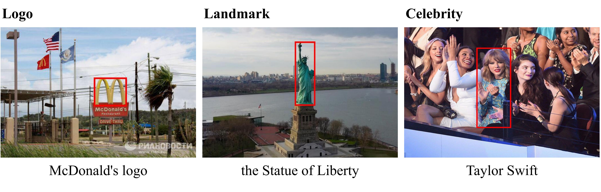
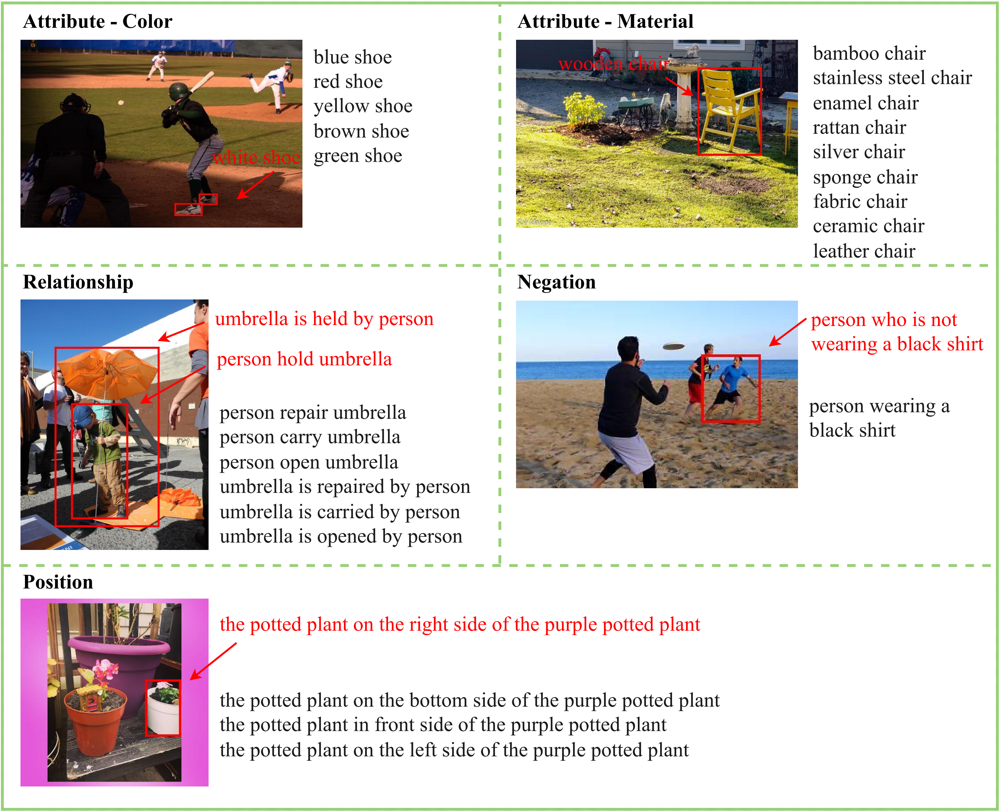
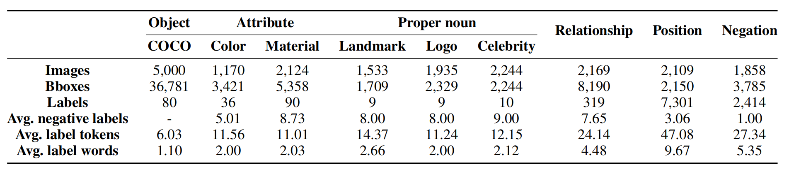
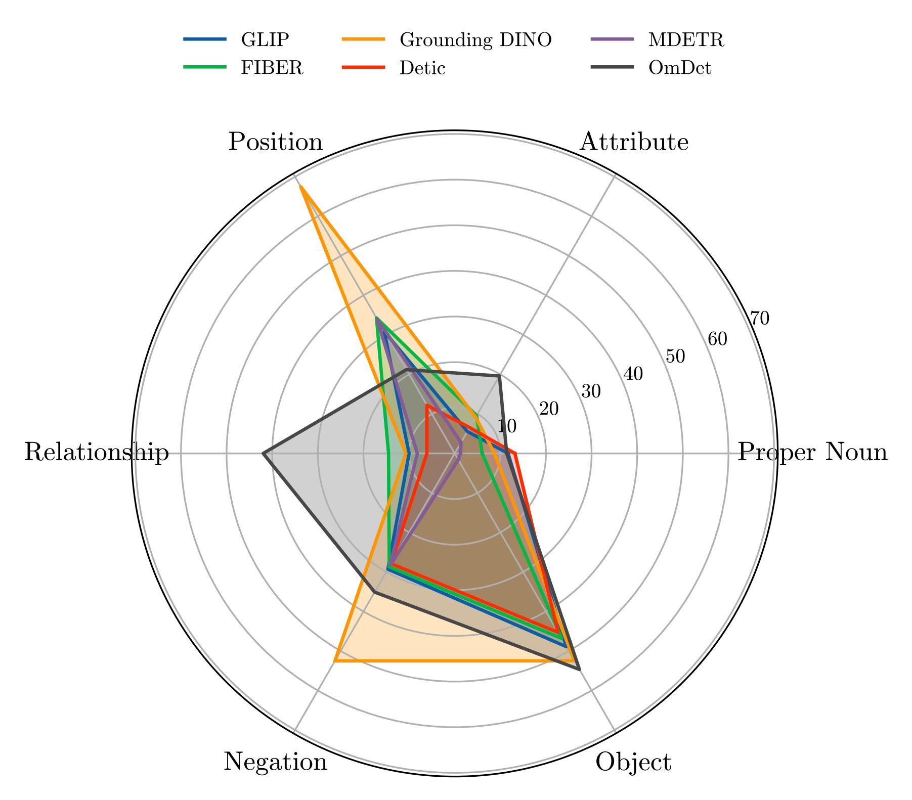
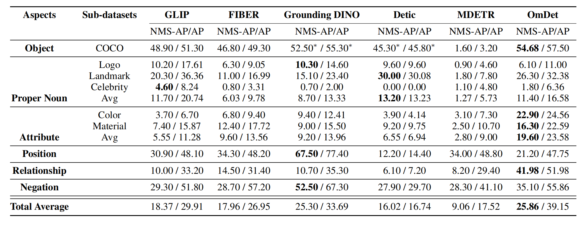

# OVDEval
<h3 align="center"> A Comprehensive Evaluation Benchmark for Open-Vocabulary Detection</h3>
<p align="center">
 <a href="https://arxiv.org/abs/2308.13177"><strong> [Paper 📄] </strong></a> <a href=https://huggingface.co/datasets/omlab/OVDEval><strong> [Dataset 🗂️] </strong></a>
</p>


***
OVDEval is a new benchmark for OVD model, which includes 9 sub-tasks and introduces evaluations on commonsense 
knowledge, attribute understanding, position understanding, object relation comprehension, and more. The dataset is 
meticulously created to provide hard negatives that challenge models' true understanding of visual and linguistic input.
Additionally, we identify a problem with the popular Average Precision (AP) metric when benchmarking models on these 
fine-grained label datasets and propose a new metric called Non-Maximum Suppression Average Precision (NMS-AP) to address this issue.

Check out Our AAAI24 paper <a href="https://arxiv.org/abs/2308.13177">[How to Evaluate the Generalization of Detection? A Benchmark for
Comprehensive Open-Vocabulary Detection]</a> for more details about the Inflated AP Problem and NMS-AP.





***
## Dataset Statistics



***
## Benchmark
<p align="center">


</p>

***
## How To Download
See Our [hugging face page](https://huggingface.co/datasets/omlab/OVDEval) for downloading OVDEval.


***
## Evaluate With NMS-AP
OVDEval should be evaluated using **NMS-AP** to avoid the inflated AP problem.
Please follow the [evaluation instructions](https://github.com/om-ai-lab/OVDEval/blob/main/Evaluation.md).

The "output" folder provides the final output JSON files obtained by applying NMS to the inference results of the GLIP model on the material test dataset.


***
## Citations
Please consider citing our papers if you use the dataset:
```
@article{yao2023evaluate,
  title={How to Evaluate the Generalization of Detection? A Benchmark for Comprehensive Open-Vocabulary Detection},
  author={Yao, Yiyang and Liu, Peng and Zhao, Tiancheng and Zhang, Qianqian and Liao, Jiajia and Fang, Chunxin and Lee, Kyusong and Wang, Qing},
  journal={arXiv preprint arXiv:2308.13177},
  year={2023}
}
```
